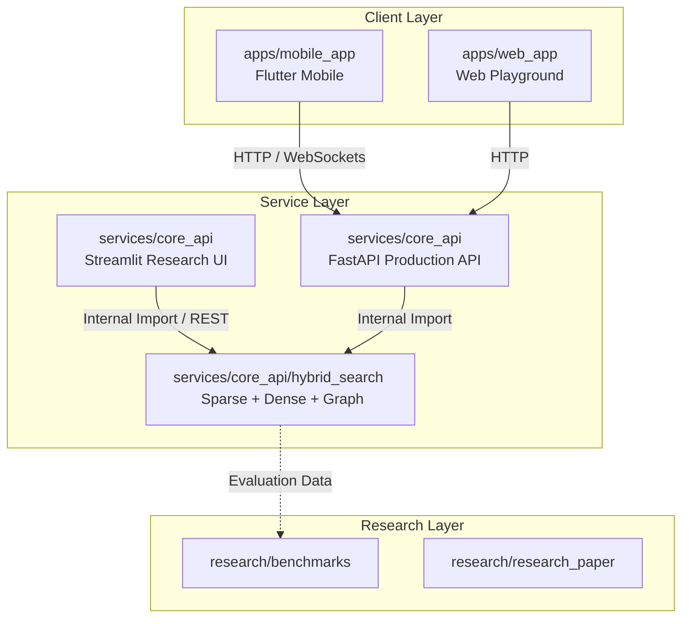

# LegalTech Super-App Monorepo

A modern LegalTech Super-App connecting users with legal resources and lawyers. It features a hybrid AI-powered legal chatbot, voice processing pipelines, and a professional social network.

---

## 🏛️ Monorepo Architecture



---

## 📂 Project Directory Structure

The project is structured as a monorepo separating applications, services, and research artifacts:

```text
Epics_App/
├── apps/                         # User-facing frontends
│   ├── mobile_app/               # Flutter mobile application
│   │   ├── android/
│   │   ├── ios/
│   │   ├── lib/                  # Screens, Providers, and L10n assets
│   │   └── pubspec.yaml
│   └── web_app/                  # Web Frontend (Vite/React playground)
│       └── index.html
│
├── services/                     # Backend APIs and pipelines
│   └── core_api/                 # Consolidated Python FastAPI backend
│       ├── app/                  # Main production API endpoints
│       ├── hybrid_search/        # Hybrid Retrieval engines (Sparse + Dense + Graph)
│       ├── tests/                # Core backend test suites
│       └── docs/                 # Voice AI & architecture docs
│
├── research/                     # Evaluation, reports, and papers
│   ├── benchmarks/               # Performance evaluation and metrics
│   ├── research_paper/           # LaTeX & PDF research source papers
│   ├── docs/                     # Deployment notes and walk-throughs
│   └── wireframes/               # HTML layout mockups
│
└── README.md                     # Monorepo overview (this file)
```

---

## 🚀 Setup and Installation

### Prerequisites
* [Flutter SDK](https://docs.flutter.dev/get-started/install)
* [Python 3.10+](https://www.python.org/downloads/)
* [uv](https://github.com/astral-sh/uv) (recommended for Python environment and dependency management)
* [Git](https://git-scm.com/)

---

### 1. Backend Setup (`services/core_api`)

1. **Navigate to the backend directory:**
   ```bash
   cd services/core_api
   ```

2. **Initialize environment and install dependencies using `uv`:**
   ```bash
   uv venv
   # On Windows:
   .venv\Scripts\activate
   # On macOS/Linux:
   source .venv/bin/activate

   uv pip install -r requirements.txt -r requirements_hybrid.txt
   ```

3. **Configure Environment Variables:**
   Configure a `.env` file inside `services/core_api/` based on the `.env.example` template.

4. **Start the FastAPI Server:**
   ```bash
   uv run app/main.py
   ```
   The API will be available at `http://localhost:8001`. You can view the Interactive Docs at `http://localhost:8001/docs`.

5. **Start the AI Research Streamlit Interface:**
   ```bash
   uv run streamlit run streamlit_app.py
   ```

---

### 2. Mobile App Setup (`apps/mobile_app`)

1. **Navigate to the mobile app directory:**
   ```bash
   cd apps/mobile_app
   ```

2. **Install dependencies:**
   ```bash
   flutter pub get
   ```

3. **Generate localization files:**
   ```bash
   flutter gen-l10n
   ```

4. **Run the application:**
   ```bash
   flutter run
   ```

---

## 🧪 Testing

To run the backend test suite:
1. Navigate to the core API directory:
   ```bash
   cd services/core_api
   ```
2. Run tests:
   ```bash
   uv run pytest tests/test_backend.py
   ```
