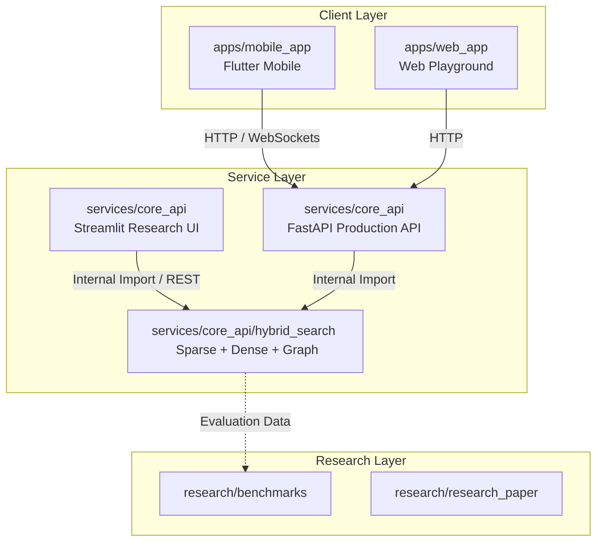
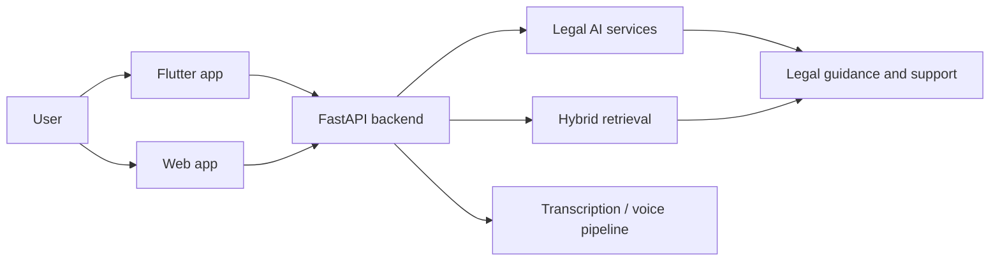

# LegalTech Super-App

AI-powered LegalTech super-app monorepo built to connect people with legal help, legal resources, and modern digital workflows across mobile, web, and backend services.

It combines a Flutter mobile experience, a React/Vite web workspace, and a FastAPI service layer with hybrid retrieval, WebSockets, and voice-enabled capabilities. The repository is laid out to support product development, experimentation, and future scaling in one place.

## Why this project stands out

This codebase is more than a demo app. It presents a full-stack product direction with a recruiter-friendly story: a real-world problem space, a multi-platform UI layer, a Python backend, AI-assisted legal interaction, and a research-backed retrieval pipeline.

Highlights:

- Multi-platform client strategy with Flutter for mobile and React/Vite for web experimentation.
- FastAPI backend designed for production-style API delivery, real-time communication, and service orchestration.
- Hybrid legal search layer that combines sparse, dense, and graph-based retrieval ideas.
- Voice-oriented workflows that support transcription and conversational legal assistance.
- Research and documentation folders that show product thinking, evaluation, and technical depth.

## Core product capabilities

The current project direction supports several practical legal-tech workflows:

- AI legal chat for guided legal support and question answering.
- Lawyer discovery and client-to-lawyer communication flows.
- Document upload and review-oriented interactions.
- Voice capture and transcription pipelines for hands-free input.
- User and lawyer dashboards with localized mobile UX.
- Authentication, profile management, notifications, help, and account-related app flows.

## Architecture

The repository is organized as a monorepo so each layer can evolve independently while still fitting into one product vision.



### Additional flow view



## Repository structure

```text
Epics_App/
├── apps/
│   ├── mobile_app/        # Flutter mobile client
│   └── web_app/           # React/Vite web workspace
├── services/
│   └── core_api/          # FastAPI backend, hybrid search, and voice services
├── research/
│   ├── benchmarks/        # Experimental results and evaluation artifacts
│   ├── docs/              # Architecture and deployment documentation
│   ├── research_paper/    # Research-paper style documentation
│   └── wireframes/        # UI/UX drafts and layout exploration
└── README.md
```

## Tech stack

- Flutter for the mobile client.
- React, Vite, and Axios for the web workspace.
- Python, FastAPI, and Streamlit for backend and research interfaces.
- Riverpod, GoRouter, and localization support in the Flutter app.
- WebSockets, voice recording, and audio playback packages for real-time interaction.
- Hybrid search components for retrieval-driven legal assistance.

## Getting started

### Backend

The backend lives in `services/core_api` and is managed with `uv`.

```bash
cd services/core_api
uv venv
.venv\Scripts\activate
uv pip install -r requirements.txt -r requirements_hybrid.txt
uv run app/main.py
```

The API is available at `http://localhost:8001`, with interactive docs at `http://localhost:8001/docs`.

To launch the research UI:

```bash
uv run streamlit run streamlit_app.py
```

### Mobile app

The Flutter client lives in `apps/mobile_app`.

```bash
cd apps/mobile_app
flutter pub get
flutter gen-l10n
flutter run
```

### Web workspace

The web app lives in `apps/web_app`.

```bash
cd apps/web_app
npm install
npm run dev
```

## Testing

Run backend tests from the core API service:

```bash
cd services/core_api
uv run pytest tests/test_backend.py
```

## Notes for reviewers

This repository is best read as a product-and-engineering portfolio piece. It shows:

- a clear problem domain,
- a layered full-stack architecture,
- UI clients for different platforms,
- backend services with AI and retrieval components,
- and supporting research artifacts that document the reasoning behind the system.

That makes it suitable for recruiters who want to see both implementation depth and product thinking in one repo.
