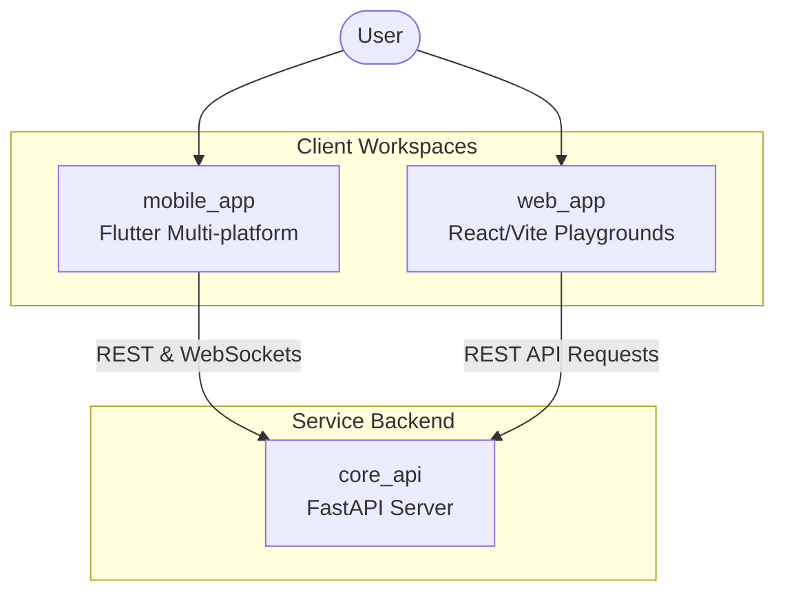

# Frontends & Client Applications 🖥️

This directory hosts user-facing applications of the LegalTech monorepo.

---

## 🏛️ Client Communication Flow

---

## 📂 Subprojects

* **[`/mobile_app`](./mobile_app)**: The production Flutter mobile client codebase supporting localized languages, riverpod state providers, and real-time support channels.
* **[`/web_app`](./web_app)**: The production React/Vite web application workspace integrated with Firebase Auth, Firestore client profiling, and live Cloud Run RAG backend querying.
