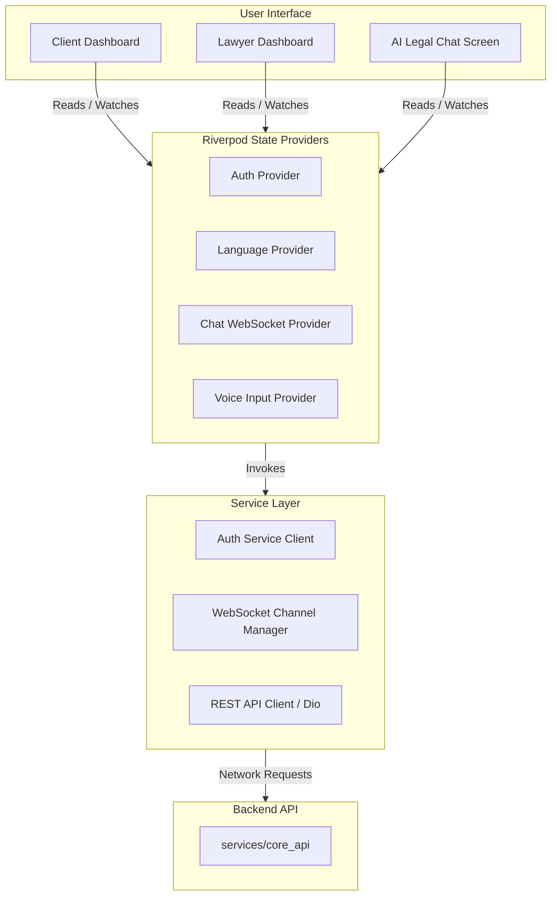

# LegalTech Flutter Mobile Application 📱

The mobile application for the LegalTech Super-App, built with Flutter and Dart. It offers distinct client and lawyer interfaces, localized multi-language support, real-time messaging, and interactive voice-based AI legal advice.

---

## 🏛️ Application Architecture

The mobile client follows a clean architecture separating UI components, state management (providers), and external backend service clients.



---

## ⚙️ Features

1. **Dual-Dashboard Layout**: Dynamic toggle between the Client dashboard (AI tools, lawyer search) and Lawyer dashboard (professional feed, incoming chats).
2. **State Management**: Streamlined using **Riverpod** to reactively update network statuses and chat histories.
3. **Localizations**: Supports 6 regional languages out-of-the-box (English, Hindi, Tamil, Telugu, Kannada, Malayalam).
4. **WebSocket Real-time Inbox**: Direct messaging interface between clients and advocates.

---

## 🚀 Running the App

1. Ensure the backend FastAPI server is running.
2. Install Flutter packages:
   ```bash
   flutter pub get
   ```
3. Generate localized translations:
   ```bash
   flutter gen-l10n
   ```
4. Run:
   ```bash
   flutter run
   ```
