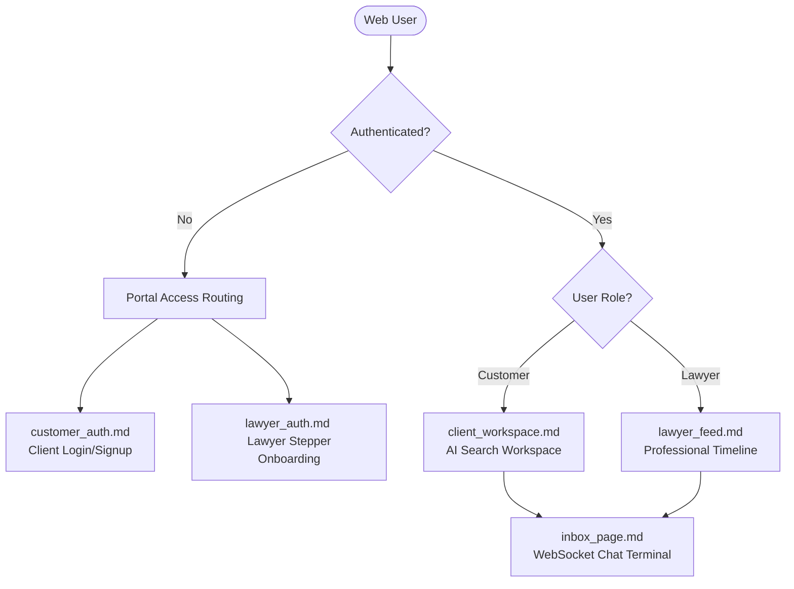

# LegalTech Web Client App 🌐

The desktop and web interface for the LegalTech Super-App, structured to support split-screen AI legal workspace controls, advocate professional social timelines, and real-time client-advocate WebSocket consultation inbox channels.

---

## 🏛️ Routing & Component Flow

---

## 📂 Detailed Pages & System Specifications

We maintain fully-detailed layout, state, and interaction maps for each module in this project:

### 🔐 Authentication & Onboarding
* **[Customer Login & Signup](docs/customer_auth.md)**: Details the client-side credential validations, login inputs, and `/auth/register` REST endpoints.
* **[Lawyer Onboarding Stepper](docs/lawyer_auth.md)**: Details the multi-step verification wizard (Bar Council details, Specializations, PDF uploads) and verification queue holding page state.

### ⚖️ Dashboards, Workspaces & Tracking
* **[Customer Workspace (Client Chat)](docs/client_workspace.md)**: Outlines the three-column layout, voice query recording waveforms, hybrid RAG parameter toggles, and case text citation hydration.
* **[Lawyer Professional Hub (Feed)](docs/lawyer_feed.md)**: Outlines the main timeline stream (post creation and likes/comments), top warning verification banner overlays, and incoming customer inquiry lists.
* **[Case Consultation & Progress Tracker](docs/case_tracking.md)**: Details the active timeline tracking boards for clients and the inquiry resolution panel/stage modifier for lawyers.

### 💬 Real-Time Communication
* **[WebSocket Messaging Inbox](docs/inbox_page.md)**: Details connection headers, JSON broadcast frames, unread counter badges, and client-side message state.
* **[Developer Integration Guide (Chat & Voice)](docs/integration_guide.md)**: Code-level instructions for initiating WebSockets, sending text frames, transmitting voice recordings via REST FormData, and playing back gTTS audio files in the browser.

### 🔐 Security & Access Control
* **[Security & Authentication Specification](docs/security_plan.md)**: Details JWT tokens setup, secure WebSocket handshake verification filters, route guards (role-based/verification hold states), and file upload sanitization rules.

### 🛠️ Backend Task Spec
* **[Backend & Data Storage Specification](docs/backend_tasks.md)**: Explains the self-contained local SQLite storage strategy (showing why third-party servers like Firebase are unnecessary) and lists backend coding tasks (B1-B4) for database initialization and authentication.
