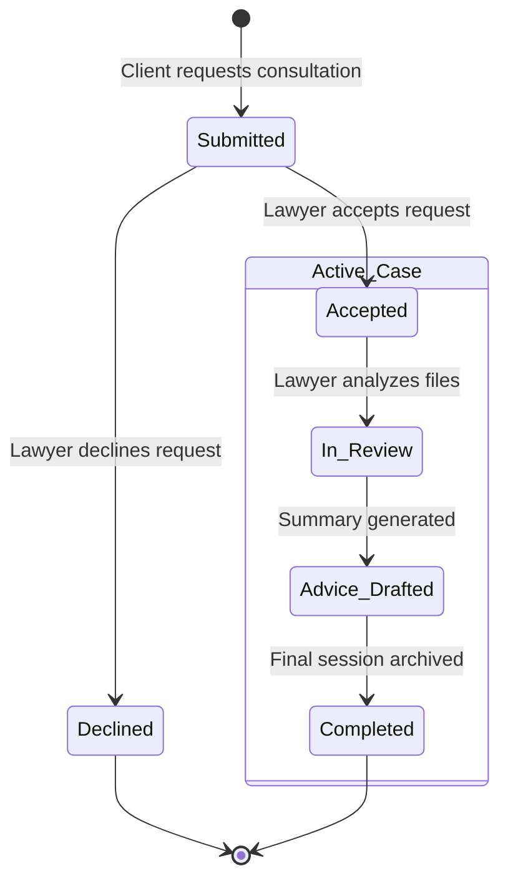

# Page Specification: Case Consultation Request & Progress Tracking ⚖️📈

This document details the layout, data structures, workflow stages, and API communication for the **Consultation Request and Progress Tracking System** available to both Customers and Lawyers.

---

## 🏛️ Case Lifecycle & Request States

A consultation request flows through five distinct states, represented dynamically on both user dashboards.



---

## 👤 Customer View: "My Case Requests & Progress"

For customers, this page is accessed via the navigation menu as **"My Cases"**. It contains two panels:

### 1. Active & Pending Cases Timeline
* **Visual Representation**: A vertical progress timeline (glowing node points) indicating the status of each request.
* **Timeline Stages**:
  * `[Node 1] Request Sent` (Green/Grey highlight)
  * `[Node 2] Accepted by Advocate` (Includes lawyer name and profile shortcut)
  * `[Node 3] Case File Review` (Indicates if the lawyer is scanning the customer's uploaded PDFs)
  * `[Node 4] Legal Advice Ready` (Clicking downloads the compiled PDF brief)
* **Status Badges**: Translucent tags mapping: `PENDING` (yellow), `ACTIVE` (blue), `COMPLETED` (green), `DECLINED` (red).

### 2. Browse & Filter Lawyers (Directory Panel)
* A grid system displaying cards of available legal professionals.
* Search and filter controls: filter by specialized category (`criminal_law`, `corporate_law`, etc.) and experience range.

---

## 👨‍⚖️ Lawyer View: "Inquiry Manager & Case Tracker"

For lawyers, this page is the central hub for business intake, accessed as **"Case Inquiries"**.

### 1. Incoming Inquiries Console
* **Inquiry Cards**: Shows the client's name, a 1-line query summary, practice domain tag, and two buttons:
  * **Accept Request** (Green glass button): Transitions state to `Accepted` (establishing the consultation agreement; peer chat is deferred to future roadmap updates).
  * **Decline Request** (Red outline button): Fades the card out and registers `Declined` state.

### 2. Active Case Tracker (WIP Stepper)
For accepted cases, the lawyer manages the client file in a tabular tracking board:
* **Stage Modifier**: A dropdown dropdown for each case allowing the lawyer to manually progress the timeline status (e.g. *Mark as In Review*, *Upload Advice Brief*).
* **Client Document Viewer**: Direct access to the PDF documents uploaded by that specific client.

---

## 📡 API Payload Specifications

### 1. Client Submits Request (`POST /legal/cases/request`)

* **Request Payload**:
  ```json
  {
    "lawyer_id": 102,
    "user_query_summary": "Inquiry regarding land acquisition compensation notice under Act 2013.",
    "attached_document_ids": ["doc_8f1a7b2c"]
  }
  ```
* **Success Response (`221 Created`)**:
  ```json
  {
    "case_id": "case_abc98211",
    "client_id": 101,
    "lawyer_id": 102,
    "status": "submitted",
    "created_at": "2026-07-06T14:50:00Z"
  }
  ```

### 2. Lawyer Resolves Request (`POST /legal/cases/resolve`)

* **Request Payload**:
  ```json
  {
    "case_id": "case_abc98211",
    "action": "accept"  // or "decline"
  }
  ```
* **Success Response (`200 OK`)**:
  ```json
  {
    "case_id": "case_abc98211",
    "status": "accepted",
    "resolved_at": "2026-07-06T14:51:00Z"
  }
  ```

### 3. Progressing Case Stage (`PATCH /legal/cases/{case_id}/stage`)

Used by the lawyer to update the timeline.

* **Request Payload**:
  ```json
  {
    "new_stage": "in_review" // or "advice_drafted", "completed"
  }
  ```
* **Success Response (`200 OK`)**:
  ```json
  {
    "case_id": "case_abc98211",
    "status": "active",
    "current_stage": "in_review",
    "updated_at": "2026-07-06T14:52:00Z"
  }
  ```
