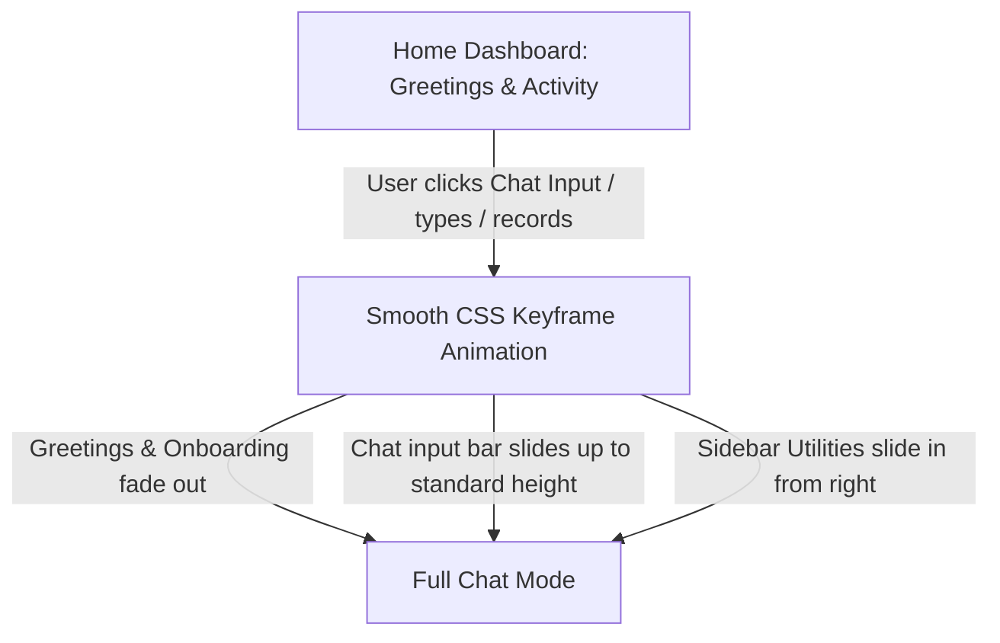

# Layout Concepts: Client AI Legal Dashboard 🎨

This document proposes three visual layout concepts to arrange the AI Chatbot, Voice Recording, Lawyer Directory, and Transcript Export features.

---

## 🖼️ Concept 1: Split-Screen Workspace (Recommended)

This layout divides the screen into two primary functional areas, keeping the chatbot central while providing quick utility access.


### **Layout Breakdown**
* **Left Panel (65% width) - Interactive Chatbot**:
  * **Top Bar**: Displays the AI Status and a button to 📄 **"Export PDF Summary"** of the active conversation.
  * **Middle (Scrollable)**: Alternating dark-blue message bubbles (Client) and glassmorphic translucent bubbles (AI Advisor) containing clickable amber legal citations.
  * **Bottom Bar**: Combined text input field and a floating **Microphone Button** (which transforms into a pulsing blue soundwave when recording).
* **Right Panel (35% width) - Side Utilities**:
  * **Top Card**: **"Save Case Transcript"** folder status (organizes active chat sessions).
  * **Bottom Card**: **"Verified Lawyer Directory"** showing advocate profile cards (profile picture, practice domains, "Consult Now" chat shortcut).

---

## 🎛️ Concept 2: Dynamic Full-Width Chat with Collapsible Side Drawer

Focuses entirely on the Chatbot experience with sliders.

```text
+---------------------------------------------------------------------------------+
|                                 Header (Navigation & History)                    |
+---------------------------------------------------------------------------------+
|                                                                                 |
|                                                                                 |
|                        Centered Chatbot Terminal (max-w-3xl)                    |
|                        - Large, readable legal Q&A bubbles                      |
|                                                                                 |
|                                                                                 |
|                                                                                 |
|   +---------------------------------------+   +-----------------------------+   |
|   |  🎤 Rec / Stop (Soundwave)            |   | 📄 Generate PDF Transcript  |   |
|   +---------------------------------------+   +-----------------------------+   |
|                                                                                 |
+------------------------------------------------------------------[Drawer Trigger]
```

### **Layout Breakdown**
* **Primary Screen (100% width)**: Focuses completely on a centered, clean messaging layout (resembling ChatGPT or Anthropic UI).
* **Collapsible Right Drawer**: Slides out when the user clicks **"Consult Lawyer"** or **"Saved Transcripts"** from the navigation header, preserving maximum space.

---

## 📊 Concept 3: Three-Card Dashboard Grid

Best suited for a dashboard portal landing area.

* **Card 1: AI Legal Advisor (Full Height, Left 50%)**: Dedicated chatbot box.
* **Card 2: Export Hub & Audio Manager (Top Right 50% width, 30% height)**: Quick-actions interface (recording waveforms, PDF compiler progress bars).
* **Card 3: Lawyer Finder & Consults (Bottom Right 50% width, 70% height)**: Profile list scroll panel.
## 🪄 Concept 4: Smooth-Transition Portal Chat (User Defined SOTA Layout)

This layout centers the onboarding experience on a transition-based landing portal that transforms into a full conversational AI assistant when the user focuses on the input bar.

### **1. Initial Screen State (Home Dashboard)**
* **Greeting Overlay**: A large, elegant glassmorphic greeting card centered on screen (e.g. *"Hello Ayush. How can we assist you with legal research today?"*). This greeting has a soft fade-out/vanish animation after 3 seconds or as soon as the user interacts with the input.
* **Onboarding & Instructions**: A grid below the greeting explaining key actions:
  * *"Ask legal precedents"*
  * *"Scan rental/compliance agreements"*
  * *"Connect with verified advocates"*
* **Recent Activity Cards**: Side-scrollable list showing recent chat histories, saved PDF briefs, and active consultation requests.
* **Sticky Bottom Chat Anchor**: The Chat Input bar (text box + Mic icon) rests at the very bottom of the viewport fold. It acts as the gateway to the chatbot. The user can scroll vertically to review further instructions, but the chat input bar smoothly pins/scrolls with the screen.

---

### **2. Focus & Transition Flow**



### **3. Full Conversational State (Active Chat)**
* The greeting card and initial instructions dissolve.
* The message stream list appears in the newly cleared central space, showing the dialogue bubbles.
* The right sidebar utility drawer slides in, revealing the **"Verified Lawyer Directory"** and **"Saved Transcripts"** cards.
* A top menu bar appears offering the **"Export PDF Summary"** button.
* Double-clicking the screen background or clicking a "Back to Dashboard" arrow reverses the animation back to the Home Dashboard view.

---

## 🏛️ Concept 5: Three-Panel Premium Legal Workspace

A layout optimized for side-by-side legal document reading, conversational chatbot queries, and historical session recall.

```
+---------------------------------------------------------------------------------+
|                                 Header (Navigation & Global Search)              |
+--------------------------+------------------------------+-----------------------+
|                          |                              |                       |
|   Left Sidebar (20%)     |   Center Chat Area (50%)     |   Right Sidebar (30%) |
|   - "Saved Sessions" only|   - Active chat stream       |   - Context Hydrator  |
|   - Categorized list     |   - Clickable citations      |   - Case summaries    |
|   - Quick reload icons   |   - Auto-expands on long     |   - Active lawyer matching|
|                          |     responses (1000+ chars)  |   - PDF Generation Hub|
|                          |                              |                       |
+--------------------------+------------------------------+-----------------------+
```

### **1. Left Sidebar: Curated Saved History**
* Unlike standard chat lists that show every single interaction, this sidebar **only displays explicitly saved/bookmarked sessions**.
* Prevents clutter and acts as a folder registry (e.g., *"Divorce Consultation - June 2026"*, *"Rental Dispute Draft"*).

### **2. Center Chat Workspace: Dynamic Content Expansion**
* Handles standard short messages cleanly as floating text bubbles.
* **Large Content Handling**: If a response exceeds **1000 characters** (e.g. the AI returns a long statutory text or a detailed IRAC case brief):
  * The message bubble expands into a structured, read-friendly **"Document Card"** with inline headers, bullet points, and citation highlights.
  * An inline **"Read Mode"** button expands this card to dim the sidebars for uninterrupted reading.

### **3. Right Sidebar: Contextual Hydration & Action Panel**
* Hydrates dynamically based on the active chat context:
  * **Citations View**: Clicking any section pill inside a 1000+ character response instantly populates this sidebar with the full legal code text.
  * **Matches Panel**: Displays profile cards for lawyers specialized in the exact practice domain matching the active conversation.

---

## 🛠️ Advanced Interactive Widgets & Mobile Responsiveness

To complete the layout, we specify the detailed behavior of auxiliary chat components and multi-screen responsiveness:

### **1. Audio Voice Note Player (Inline Chat Widget)**
When the API returns a `audio_response_url` (from gTTS backend), it is rendered inside the chat bubble as a WhatsApp-style voice note widget:
* **UI Elements**:
  * Circular Play/Pause button.
  * **Visual Seekbar**: A wave-style progress bar showing track duration (e.g. `0:42 / 1:15`).
  * **Speed Controller Toggle**: Small pill button to cycle playback speed (`1.0x` $\rightarrow$ `1.5x` $\rightarrow$ `2.0x`).

### **2. PDF Compiler Progress HUD**
Clicking **"Export PDF Summary"** triggers a translucent circular progress indicator over the center screen, displaying compiling stages:
1. *Synthesizing Chat Logs...*
2. *Appending Legal Precedents...*
3. *Generating PDF...*
Upon completion, the overlay fades out, and a **"Save/Download File"** browser trigger is executed.

### **3. Mobile & Tablet Folding Breakpoints**
On viewports less than `1024px` (Tablet and Mobile):
* **Panel Folding**: The Left Sidebar (History) and Right Sidebar (Context/Lawyers) collapse completely into sliding overlays.
* **Control Triggers**:
  * Swipe from left edge opens **Saved Sessions**.
  * Clicking an active citation or lawyer icon opens the **Context Drawer** sliding up from the bottom of the screen.
  * The center chat area remains full-width (`100%`) for optimal typing and message readability.


