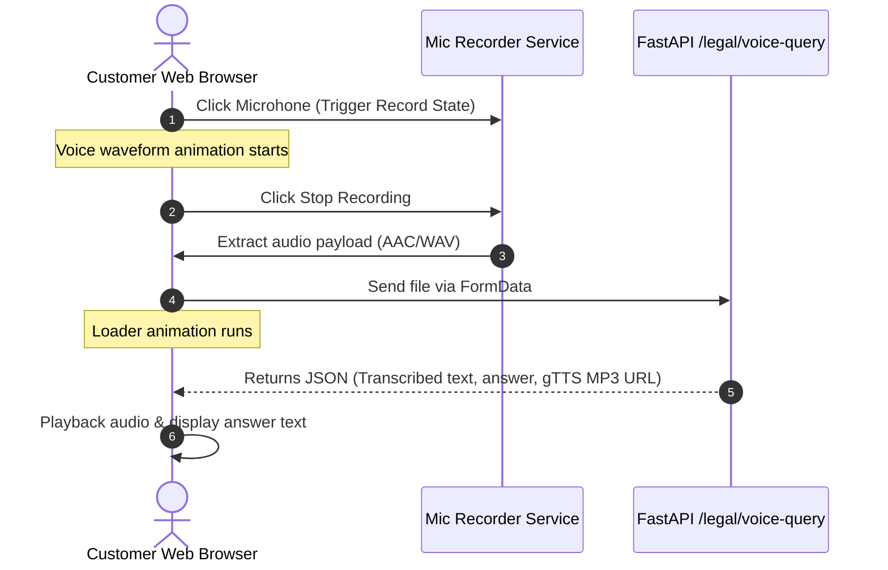

# Page Specification: Client AI Legal Research Workspace 👤⚖️

This document details the layout, interface controls, and communication specs for the **Customer/Client Dashboard**. This workspace is designed for users seeking legal advice, query processing via RAG, and lawyer discovery.

---

## 🎨 Visual Layout & Component Specs

The client dashboard is laid out in a **Three-Column Grid System** to offer dense but clean information delivery.

```
+---------------------------------------------------------------------------------+
|                                 Header (Navigation & Profile)                    |
+-------------------------------------------------------+-------------------------+
|                                                       |                         |
|   Column 1: AI Assistant & Voice Input (50%)          |   Column 3:             |
|   - Real-time chat dialogue screen                    |   Verified Directory    |
|   - Floating mic button (Pulse recording animation)   |   (20%)                 |
|   - Language switcher dropdown                        |   - List of advocates   |
|   - Retrieval configuration dropdown                  |   - Active status       |
|                                                       |   - "Consult" triggers  |
|                                                       |                         |
|-------------------------------------------------------+                         |
|   Column 2: Precedent Hydration & Document (30%)      |                         |
|   - Judgment text explorer                            |                         |
|   - Highlighted Sections & Articles (Amber tags)      |                         |
|   - Upload target for PDFs (Case summaries)           |                         |
|                                                       |                         |
+-------------------------------------------------------+-------------------------+
```

### Aesthetic Spec
* **Theme**: Glassmorphic panels floating on a dark navy `#0B0F19` backdrop.
* **Component Styling**: Panel card background `rgba(30, 41, 59, 0.45)`, border `1px solid rgba(255, 255, 255, 0.08)`.
* **Citations Tags**: Display sections (e.g. *"Sec. 302 IPC"*) in glowing amber pill tags (`color: #FBBF24; background: rgba(251, 191, 36, 0.1)`).

---

## 🔁 User Interactions & Voice Queries



### Retrieval Toggles (Dropdown)
* **Search Mode Selection**: Dropdown menu allowing the client to explicitly configure the RAG search mode:
  1. **Keyword**: Raw SQLite FTS keyword matches.
  2. **Semantic**: Pure dense vector similarity.
  3. **Hybrid (Recommended)**: Sparse + Dense (RRF rank-fused).
  4. **Ultra**: Hybrid + Cross-Encoder re-ranking.

---

## 📡 API Payload Specifications

### 1. Execute Voice/Text Query (`POST /legal/voice-query`)

* **Request Headers**:
  ```http
  Authorization: Bearer <user_token>
  Content-Type: multipart/form-data
  ```
* **Form Data Parameters**:
  * `query`: Optional text string (if typed instead of recorded).
  * `audio`: Binary audio file (if microphone was used).
  * `search_mode`: "hybrid" (matches retrieval toggle selection).
* **Success Response (`200 OK`)**:
  ```json
  {
    "query_detected": "What is the penalty for culpable homicide under Indian law?",
    "transcription": "What is the penalty for culpable homicide under Indian law?",
    "answer": "According to Section 304 of the Indian Penal Code, culpable homicide not amounting to murder is punishable with imprisonment for life...",
    "precedents": [
      {
        "case_id": "sc_2019_982",
        "title": "State of Maharashtra v. Sanjay",
        "score": 0.895
      }
    ],
    "audio_response_url": "/static/audio/response_3f8a92b1.mp3"
  }
  ```

### 2. Document Analysis (`POST /legal/analyze-document`)

Allows customers to upload case papers for legal terminology mapping and summarization.

* **Payload**: Multipart form data with `file` parameter.
* **Success Response (`200 OK`)**:
  ```json
  {
    "summary": "This document represents a rental lease contract...",
    "detected_violations": [
      "Clause 14 contradicts Section 23 of the Indian Contract Act."
    ],
    "entities": ["Lease Contract", "Tenant", "Landlord"]
  }
  ```
