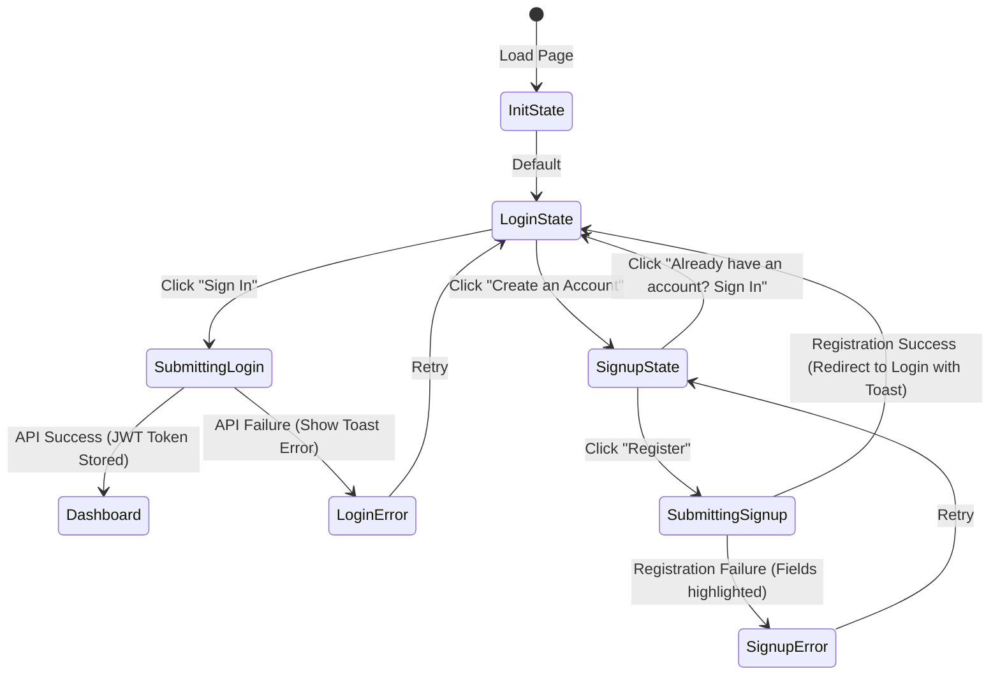

# Page Specification: Customer Authentication & Onboarding 👤

This document provides a detailed layout, design, interaction model, and API communication spec for the **Customer Authentication & Onboarding** page in the LegalTech web application.

---

## 🎨 Visual Design & Layout Specs

The customer login/signup utilizes a **Split-Pane Layout** (50/50 split on desktop screens, collapsing to a single-column layout on tablet and mobile viewports).

### Left Pane: Brand & Value Visuals
* **Background**: A deep, rich gradient transition from midnight black (`#0B0F19`) to deep royal blue (`#1E293B`).
* **Visual Elements**:
  * An animated glassmorphic panel illustrating the core value pillars: AI Legal Assistant, Verified Lawyers Directory, and Encrypted Legal Vault.
  * Subtle pulsing ambient background light sources to create depth.
* **Typography**: Outlined branding titles in **Outfit** font with soft text gradients.

### Right Pane: Interactive Auth Form Container
* **Background**: Solid `#0F172A` (deep grey-blue) with a card panel featuring a subtle border (`1px solid rgba(255, 255, 255, 0.05)`).
* **Forms**: Contains the toggles for:
  * **Sign In Form**: Username/Email field, Password field (with a reveal/hide toggle), "Remember Me" checkbox, and "Forgot Password" link.
  * **Sign Up Form**: Full Name, Username, Email, Password, Confirm Password, and a mandatory Legal Consent checkbox.

---

## 🔁 User Flows & State Transitions



### 1. Form Validation States (Client-Side)
* **Email Validation**: Enforce RFC 5322 regex validation.
* **Password Strength**: Minimum 8 characters, containing at least 1 uppercase letter, 1 lowercase letter, 1 number, and 1 special character.
* **Form Feedback**: Real-time error borders (`#EF4444` red) appearing `onBlur` for fields that fail validation, supplemented by help text.

---

## 📡 API Handshakes & Response Mappings

### 1. Customer Registration (`POST /auth/register`)

* **Request Payload**:
  ```json
  {
    "username": "legal_client_01",
    "email": "client@example.com",
    "password": "Password123!",
    "full_name": "Ayush A",
    "is_lawyer": false
  }
  ```
* **Success Response (`201 Created`)**:
  ```json
  {
    "id": "usr_9d2f8a11",
    "username": "legal_client_01",
    "email": "client@example.com",
    "full_name": "Ayush A",
    "is_lawyer": false,
    "is_active": true,
    "created_at": "2026-07-06T14:31:00Z"
  }
  ```
* **Validation Failure Response (`422 Unprocessable Entity`)**:
  ```json
  {
    "detail": [
      {
        "loc": ["body", "email"],
        "msg": "value is not a valid email address",
        "type": "value_error.email"
      }
    ]
  }
  ```

### 2. Customer Token Retrieval (`POST /auth/token`)

* **Request Payload (Form URL Encoded)**:
  ```http
  grant_type=password&username=legal_client_01&password=Password123!
  ```
* **Success Response (`200 OK`)**:
  ```json
  {
    "access_token": "eyJhbGciOiJIUzI1NiIsInR5cCI6IkpXVCJ9.eyJzdWIiOiJsZWdhbF9jbGllbnRfMDEiLCJleHAiOjE3ODIzMzk2MDB9...",
    "token_type": "bearer"
  }
  ```
* **Handling Authentication Errors (`401 Unauthorized`)**:
  ```json
  {
    "detail": "Incorrect username or password"
  }
  ```

---

## 📦 Global State & Storage Lifecycle
1. On successful token response, write the `access_token` to `localStorage`.
2. Update the global context `authProvider` status to `AUTHENTICATED`.
3. Fetch user info using `/auth/me` to store user metadata (full name, username, customer permissions) in the global memory store.
