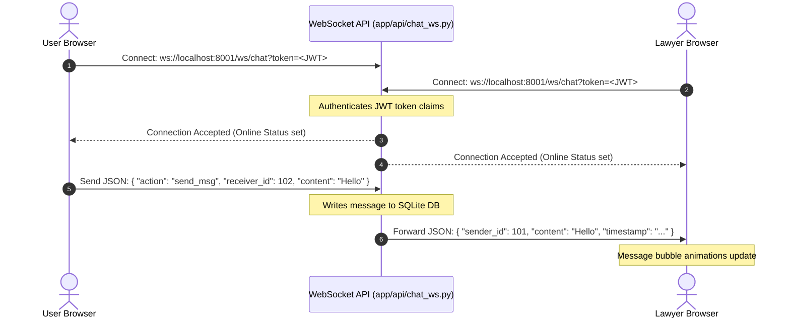

# Page Specification: Real-Time WebSocket Messaging Terminal 💬🔌

This document details the layout, real-time message stream handling, and WebSocket event structures for the **Real-Time Client-AI Inbox** in the LegalTech web application. 

> [!NOTE]
> Direct client-to-lawyer peer-to-peer messaging is designated as a **Future Roadmap Extension** (Post-MVP). In the current release, the WebSocket terminal connects the client directly to the **AI Legal Assistant** using the active backend chat socket structures.

---

## 🎨 Visual Layout & Component Specs

The Inbox is structured as a **Dual-Panel Workspace** (`100vh` viewport height lock to prevent external scrolling).

```
+---------------------------------------------------------------------------------+
|                                 Header (Navigation)                              |
+------------------------------+--------------------------------------------------+
|                              |                                                  |
|   Left Panel: Contacts (30%) |   Right Panel: Chat Conversation Terminal (70%)  |
|   - Search conversations     |   - Conversation Header (Name, Online status)    |
|   - Contact list cards:      |   - Scrollable Message Bubble Area               |
|     * Avatar indicator       |   - Rich chat input (Attachment & Send button)   |
|     * Unread message badge   |                                                  |
|     * Typing indicators      |                                                  |
|                              |                                                  |
+------------------------------+--------------------------------------------------+
```

### Visual Adaptations by Role
* **For Customers**: Left panel lists **Consulted Lawyers** (showing their bar verification status badge).
* **For Lawyers**: Left panel lists **Consultation Queries** (showing language flags and quick legal summaries).

---

## 🔁 Real-Time Messaging Lifecycle (WebSocket)



---

## 📡 WebSocket Frame Specifications

The communication over the socket is serialized using standard JSON frames:

### 1. Connection URL
Both users open connection pointing to the central chat websocket router:
```http
ws://localhost:8001/ws/chat?token=<JWT_ACCESS_TOKEN>
```

### 2. Client Sending Message Frame
Sent from the client browser to the socket server:
```json
{
  "action": "send_msg",
  "receiver_id": 102,
  "content": "Hello, I wanted to inquire about the retainer agreement terms."
}
```

### 3. Server Broadcast Message Frame
Dispatched by the server directly to the active receiver's socket:
```json
{
  "event": "new_msg",
  "message_id": 482,
  "sender_id": 101,
  "sender_name": "Ayush A",
  "content": "Hello, I wanted to inquire about the retainer agreement terms.",
  "timestamp": "2026-07-06T14:34:00Z"
}
```

### 4. Typing Indicator Event
Triggered `onKeyPress` inside the chat text inputs (debounced by 300ms):
* **Request (Client to Server)**:
  ```json
  { "action": "typing", "receiver_id": 102 }
  ```
* **Broadcast (Server to Receiver)**:
  ```json
  { "event": "typing", "sender_id": 101 }
  ```
