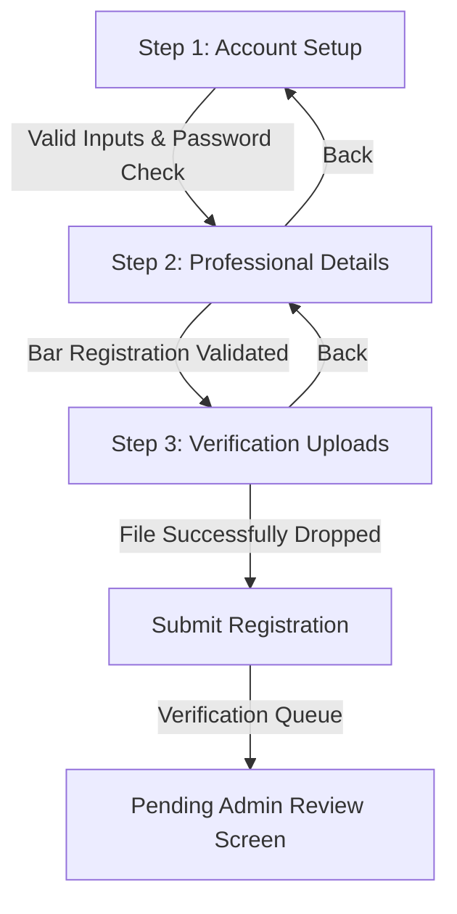

# Page Specification: Lawyer Onboarding & Authentication ⚖️

This document details the layout, registration wizard stages, verification process, and API endpoints for the **Lawyer Authentication & Onboarding** page in the LegalTech web application.

---

## 🎨 Visual Design & Layout Specs

The lawyer onboarding is designed as a **Single-Column Stepper Wizard** centered inside a clean, spacious backdrop (`#0B0F19`). This layout prevents cognitive overload for professionals filling in credential parameters.

### Form Card Spec
* **Card Frame**: Wide modal-style card (`max-w-4xl`), floating with a heavy shadow (`box-shadow: 0 20px 25px -5px rgba(0, 0, 0, 0.5)`).
* **Glassmorphism**: Border defined by `1px solid rgba(255, 255, 255, 0.08)` and background `#1E293B` with `backdrop-filter: blur(16px)`.
* **Stepper indicator**: A horizontal progress bar at the top displaying the state:
  * **Step 1: Account Setup** (Basic fields: email, password, profile picture)
  * **Step 2: Professional Details** (License details, bar council registry, experience)
  * **Step 3: Verification Documents** (Document upload/scanning area)

---

## 🔁 Step-by-Step Onboarding Steps



### **Wizard Details**

#### **Step 1: Account Setup**
* Fields: Full Name, Email, Password, Confirm Password.
* Password validation: Strict rules (minimum 10 characters, capital, digit, symbol).

#### **Step 2: Professional Details**
* **Bar Registration Number**: String input matched against regional bar association formats.
* **Practice Domains**: Checkboxes matching the category taxonomy (e.g. `civil_law`, `criminal_law`, `corporate_law`, `tax_law`).
* **Years of Practice**: Numeric input.
* **Bio / Professional Summary**: Text area (limit 1000 characters).

#### **Step 3: Verification Documents**
* **Drag-and-Drop Area**: A styled dash-border box with a drag-and-drop file upload target.
* Supported formats: `.pdf`, `.png`, `.jpg`. Max size: 10MB per file.
* Supported files: Bar Council ID card, Certificate of Practice.

---

## 📡 API Handshakes & Response Mappings

### 1. Lawyer Registration Setup (`POST /auth/register`)

Lawyers use the same authentication registration endpoint but provide extended professional parameters and set `is_lawyer` to `true`:

* **Request Payload**:
  ```json
  {
    "username": "advocate_sharma",
    "email": "sharma@example.com",
    "password": "SecureAdvocatePassword99!",
    "full_name": "Ravi Sharma",
    "is_lawyer": true,
    "bar_registration_number": "BCI/2018/4567",
    "practice_domains": ["criminal_law", "constitutional_law"],
    "years_of_experience": 8,
    "bio": "Senior advocate specializing in criminal defense and constitutional writ petitions."
  }
  ```
* **Success Response (`201 Created`)**:
  ```json
  {
    "id": "usr_7c1d3e88",
    "username": "advocate_sharma",
    "is_lawyer": true,
    "is_active": false, 
    "verification_status": "pending_documents",
    "created_at": "2026-07-06T14:31:00Z"
  }
  ```

### 2. Uploading Verification Proofs (`POST /auth/lawyer/verify-documents`)

Once the initial account is created, the client uploads PDF or image proof files using multipart form data:

* **Headers**:
  ```http
  Authorization: Bearer <temp_token>
  Content-Type: multipart/form-data
  ```
* **Form Parameters**:
  * `document_type`: "bar_council_card"
  * `file`: (binary payload)
* **Success Response (`200 OK`)**:
  ```json
  {
    "status": "success",
    "message": "Verification document uploaded successfully",
    "document_id": "doc_8f1a7b2c",
    "verification_status": "pending_admin_review"
  }
  ```

---

## 🔒 Verification Queue State
Until an administrator validates the Bar Council records:
* The lawyer's status remains `"pending_admin_review"`.
* Login will succeed, but the app router redirects to a **Hold Screen** displaying:
  * "Verification in Progress: Our legal validation team is verifying your Bar Council Registry ID."
  * Lock overlay preventing access to client inbox and feed sharing modules.
