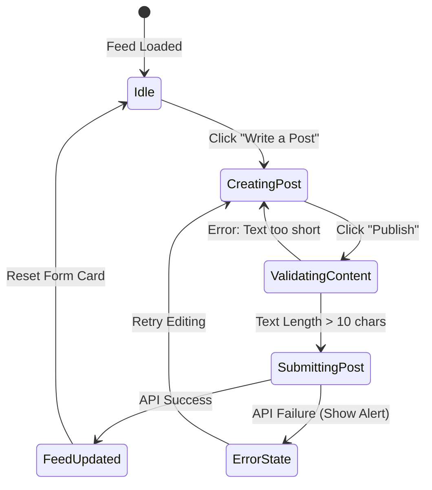

# Page Specification: Lawyer Professional Feed & Network Dashboard ⚖️📣

This document details the layout, posting interaction wizard, incoming inquiry queue, and API integrations for the **Lawyer Dashboard** in the LegalTech web application.

---

## 🎨 Visual Layout & Component Specs

The Lawyer Dashboard is structured as a **Main Timeline Stream** with contextual sidebar panels.

```
+---------------------------------------------------------------------------------+
|                                 Header (Navigation & Profile)                    |
+-------------------------------------------------------+-------------------------+
|                                                       |                         |
|   Column 1: Profile & Professional Status (25%)       |   Column 3:             |
|   - Lawyer Profile Preview (Name, domains)            |   Incoming Inquiries    |
|   - Verification Badge Status Indicator               |   (30%)                 |
|   - "Create Post" quick shortcut                      |   - Consultation list   |
|                                                       |   - Click to chat       |
|-------------------------------------------------------+   - Real-time indicator |
|   Column 2: Professional Social Timeline (45%)        |                         |
|   - Post creator text area                            |                         |
|   - Feed list (LinkedIn style advocate sharing)       |                         |
|   - Interactive features: Likes, comments             |                         |
|                                                       |                         |
+-------------------------------------------------------+-------------------------+
```

### Banner Overlay: Pending Verification Status
If the lawyer's database status is `"pending_admin_review"` or `"pending_documents"`, a **Sticky Top Banner** (`background: #E11D48` crimson-red) is displayed overlaying all controls:
> ⚠️ **Verification Pending**: You are currently in review. You will be able to publish feed posts and answer client inbox requests once our team completes Bar Council authentication.

---

## 🔁 User Interactions & Post Generation



### 1. Feed Timeline Stream
* Advocates share legal updates, opinions, or clarify recent Supreme Court precedents.
* Content supports markdown rendering inside individual post blocks.

### 2. Consultation Inquiry Queue (Sidebar)
* A list displays real-time incoming advice inquiries from customers.
* Each card shows the client's name, localized language flag, and first line of the query.
* Clicking "Open Chat" transitions the application route directly to the **Inbox Terminal**.

---

## 📡 API Payload Specifications

### 1. Retrieve Feed Timeline (`GET /legal/posts`)

* **Headers**: `Authorization: Bearer <lawyer_token>`
* **Success Response (`200 OK`)**:
  ```json
  [
    {
      "id": "post_7d8e92a1",
      "author": {
        "id": "usr_7c1d3e88",
        "full_name": "Ravi Sharma",
        "bar_registration_number": "BCI/2018/4567"
      },
      "content": "A crucial amendment was proposed today regarding Section 138 of the Negotiable Instruments Act. Legal practitioners should note...",
      "likes_count": 14,
      "created_at": "2026-07-06T14:31:00Z"
    }
  ```

### 2. Publish New Update (`POST /legal/posts`)

* **Request Payload**:
  ```json
  {
    "content": "Delighted to announce that we secured a favorable verdict in the landmark writ petition challenging municipal land acquisitions today."
  }
  ```
* **Success Response (`201 Created`)**:
  ```json
  {
    "id": "post_9f1a2c3d",
    "content": "Delighted to announce that we secured a favorable verdict in the landmark writ petition challenging municipal land acquisitions today.",
    "created_at": "2026-07-06T14:34:00Z",
    "author_id": "usr_7c1d3e88"
  }
  ```
