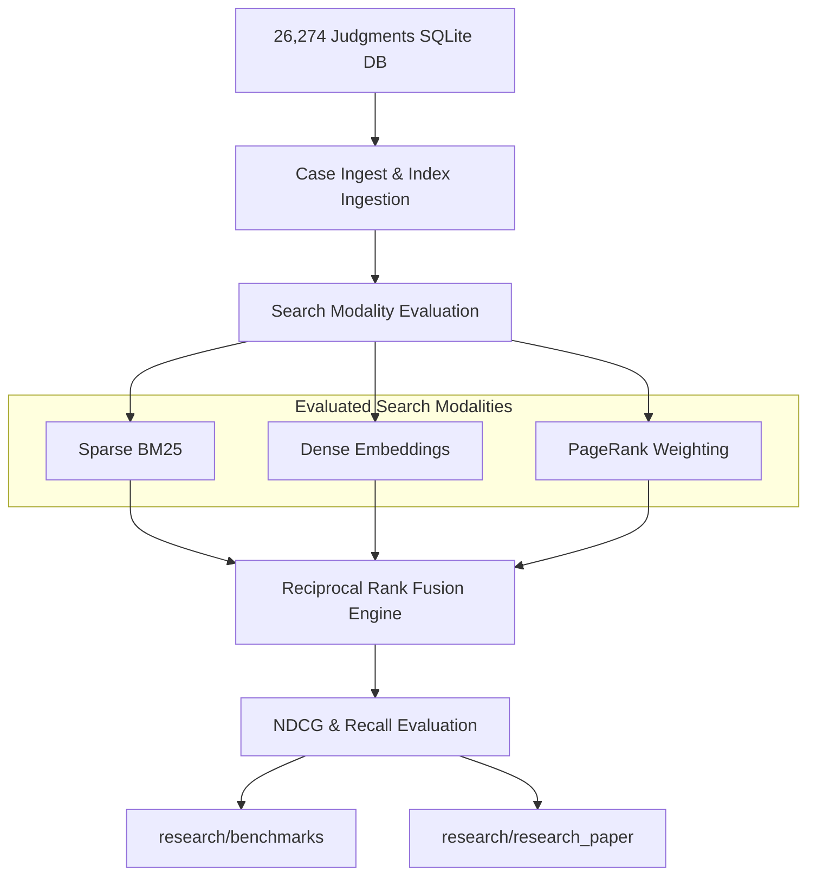

# LegalTech AI Research 🔬

This directory houses the academic, benchmark, and design research behind the Hybrid Legal RAG system.

---

## 🏛️ Research & Evaluation Flow

---

## 📂 Research Directories

* **[`/benchmarks`](./benchmarks)**: Contains evaluation runs, metric scores, and latency statistics for all search configurations.
* **[`/research_paper`](./research_paper)**: LaTeX and markdown section drafts prepared for Legal AI workshop publications.
* **[`/docs`](./docs)**: Technical reviews, design critiquing, and result analysis reports.
* **[`/wireframes`](./wireframes)**: Design layouts and HTML wireframe mockups for the legal assistant interface.
