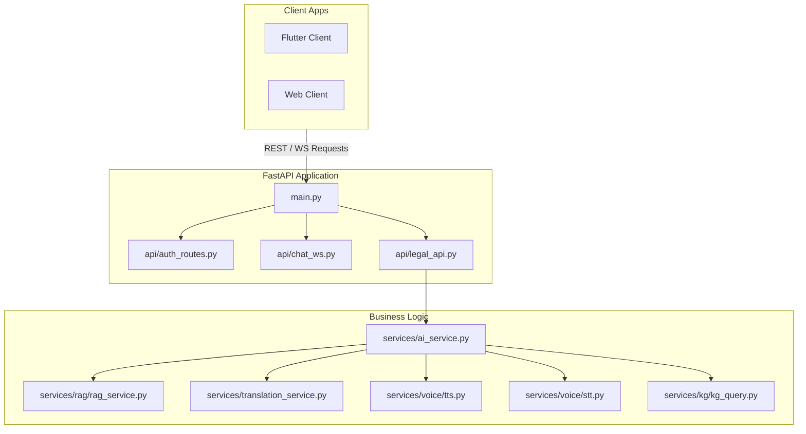

# Core Legal API Service ⚡

The backend service for the LegalTech Super-App, built on top of FastAPI. It hosts production endpoints for user authentication, real-time WebSocket communication, legal advice extraction, and integrates Whisper-based audio transcription.

---

## 🏛️ Service Layer Architecture



---

## 📂 Subfolder Layout

* **[`/app`](./app)**: Holds all production API endpoints, database schema models, authentication utilities, and core service orchestrators.
* **[`/hybrid_search`](./hybrid_search)**: Houses the advanced hybrid search engine modules (BM25 sparse search, FAISS dense indexing, PageRank citation weighting) originally developed during evaluation.
* **[`/data`](./data)**: Holds runtime index files (`faiss_index.index`), configuration graphs (`kg_mock.json`), and temporary cached media directories.
* **[`/docs`](./docs)**: Houses technical breakdowns and architecture documentations (e.g. `VOICE_AI_README.md`).
* **[`/tests`](./tests)**: Houses unified python unit and integration testing scripts.

---

## 🚀 Running locally

Run the FastAPI server using `uv`:
```bash
uv run app/main.py
```
View interactive API schemas by opening `http://localhost:8001/docs`.
