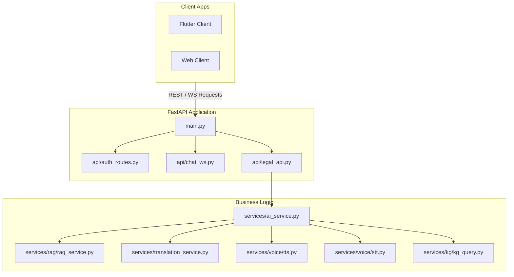

# Core Legal API Service ⚡

The backend service for the LegalTech Super-App, built on top of FastAPI. It hosts production endpoints for user authentication, real-time WebSocket communication, legal advice extraction, and integrates Whisper-based audio transcription.

---

## 🏛️ Service Layer Architecture



---

## 📂 Subfolder Layout

* **[`/app`](./app)**: Holds all production API endpoints, database schema models, authentication utilities, and core service orchestrators.
* **[`/hybrid_search`](./hybrid_search)**: Houses the advanced hybrid search engine modules (BM25 sparse search, FAISS dense indexing, PageRank citation weighting) originally developed during evaluation.
* **[`/data`](./data)**: Holds runtime index files (`faiss_index.index`), configuration graphs (`kg_mock.json`), and temporary cached media directories.
* **[`/docs`](./docs)**: Houses technical breakdowns and architecture documentations (e.g. `VOICE_AI_README.md`).
* **[`/tests`](./tests)**: Houses unified python unit and integration testing scripts.

---

## 🚀 Running locally

Run the FastAPI server using `uv`:
```bash
uv run app/main.py
```
View interactive API schemas by opening `http://localhost:8001/docs`.

---

## ☁️ Serverless Cloud Run Deployment

The production backend has been optimized for Google Cloud Run serverless hosting:
* **Image Size Optimization:** The 1.8GB database file (`data/index.db`) has been removed from the Docker image to achieve a lightweight build footprint (~300MB).
* **Startup Stream Downloader:** The application automatically streams the database from GCS (`gs://epics-legal-db/index.db`) on startup.

### 1. Build Container Image
Use Google Cloud Build to compile and push the container to Artifact Registry (excluding local environments via `.dockerignore`):
```bash
gcloud builds submit --tag gcr.io/legal-chatbot-epics/core-api --project=legal-chatbot-epics --ignore-file=.dockerignore
```

### 2. Deploy to Cloud Run
Deploy the service using high-speed startup CPU boost and individual environment variable configuration parameters:
```bash
gcloud run deploy core-api `
  --image gcr.io/legal-chatbot-epics/core-api `
  --platform managed `
  --region asia-south1 `
  --memory 2Gi `
  --cpu 2 `
  --timeout 300 `
  --update-env-vars DB_DOWNLOAD_URL="https://storage.googleapis.com/epics-legal-db/index.db" `
  --update-env-vars GROQ_API_KEY="YOUR_GROQ_API_KEY" `
  --update-env-vars GROQ_MODEL="llama-3.3-70b-versatile" `
  --allow-unauthenticated `
  --project=legal-chatbot-epics
```

