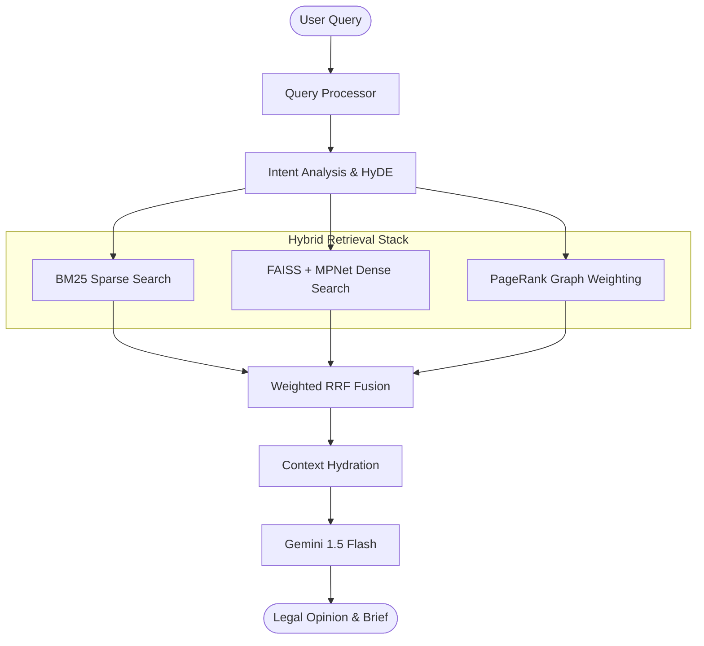

# Hybrid Legal RAG: Sparse-Dense-Graph Retrieval System ⚖️


This system integrates **BM25 Search (FTS5)**, **Dense Vector Retrieval (MPNet/FAISS)**, and **Graph-based Importance Scoring (PageRank)** into a unified Weighted RRF pipeline. It serves as the advanced hybrid search backend engine for the LegalTech Super-App.

---

## 🏗️ System Architecture



---

## 📂 Repository Structure (Consolidated in `services/core_api`)

| Relative Path | Purpose | Key Contents |
| :--- | :--- | :--- |
| [**`./hybrid_search`**](./hybrid_search) | Core Search Engine | Retrieval engine, Gemini client, and Storage handlers. |
| [**`./app`**](./app) | Production API | FastAPI routers, WebSocket handlers, and Auth modules. |
| [**`./data`**](./data) | Production Data | Centralized `index.db` (26,274 cases) and FAISS indexes. |
| [**`../../research`**](../../research) | Academic Research | Benchmarks, papers, and UX wireframes. |

---

## 📡 API Endpoints (FastAPI)

Access the interactive Swagger documentation at `/docs` (e.g., `http://localhost:8001/docs`).

| Method | Endpoint | Description |
| :--- | :--- | :--- |
| `POST` | `/legal/voice-query` | Transcribes audio via Whisper, executes Hybrid RAG, and outputs spoken gTTS response. |
| `POST` | `/auth/register` | Register new user. |
| `POST` | `/auth/token` | User login token retrieval. |
| `GET` | `/health` | Core system health check. |

---

## 📊 Performance Benchmarks (N=5,255)

The system was evaluated against a high-fidelity dataset of 26,274 judgments, specifically auditing for jurisdictional bias and retrieval density.

| Metric | Score | Delta vs. General Models |
| :--- | :--- | :--- |
| **Recall@10** | **67.8%** | +3.6% gain over BM25 |
| **InLegalBERT Recall** | **100.0%** | (Specialized SC Domain) |
| **Avg. Latency** | **1.1s** | Hybrid Fusion Optimization |

---

## 📜 Setup & Credentials
Create a `.env` file in the `services/core_api/` directory:
```env
GOOGLE_API_KEY=your_gemini_api_key_here
GEMINI_MODEL=gemini-1.5-flash
REDIS_HOST=your_redis_host (optional for remote sessions)
```

Distributed under the MIT License. Developed for the Advanced Agentic Coding initiative.
