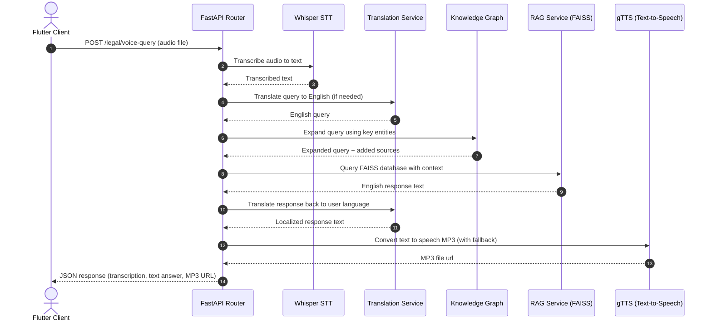

# 🎤 Voice AI & Knowledge Graph Integration

This document explains the architecture built for processing voice queries in the **LegalTech Super-App**. It details the **Multilingual Voice-to-Text Pipeline** and its integration with a **Knowledge Graph** to improve legal AI response speeds and retrieval precision.

## 🚀 Pipeline Flow

When a user asks a legal question in the app using their voice (in any language like Hindi, Tamil, Bengali, etc.), the backend handles *everything* automatically:

1. **🎤 Flutter Mic (Frontend)**  
   The user records their voice on the app. The app sends the audio file to the `POST /legal/voice-query` API endpoint.

2. **🧠 Whisper STT (Speech-to-Text)**  
   The backend uses OpenAI's Whisper model to transcribe the audio file into a text string instantly.

3. **🌍 Multilingual Translation**  
   The system detects the language of the transcribed text. If it is not English, it translates it to English so the core AI can understand the complex legal terms.

4. **🔗 Knowledge Graph Entity Expansion**  
   Before sending the query to the LLM, the script extracts legal entities (like "murder", "divorce", "bail") from the translated query and queries the custom Knowledge Graph. It then **expands** the user's query with highly relevant legal articles and case laws (e.g., adding *"Section 302 IPC, K.M. Nanavati vs State of Maharashtra"* to a simple query about murder).

5. **🔎 FAISS RAG Retrieval & LLM Generation**  
   The enriched, highly-specific query is passed to the Vector Database (FAISS) to fetch the exact legal documents, and the LLM generates an accurate legal answer.

6. **🗣️ Text-to-Speech Generation (`gTTS`)**  
   The English answer is translated *back* into the user's original language natively. Then, `gTTS` generates a spoken `.mp3` file of the translated answer, equipped with smart language fallbacks to prevent server crashes.

7. **🔊 Playback (Frontend)**  
   The API returns the original transcription, the text answer, and the URL to the generated MP3 file. The Flutter app plays the audio back to the user seamlessly.

---

## 📂 Key Files (Located in `services/core_api`)

- **[app/api/legal_api.py](../app/api/legal_api.py)** -> Exposes the `/voice-query` and `/audio/{filename}` endpoints. Handles safe file uploading, `.aac`/`.mp3`/`.wav` processing, error bounds, and orchestrates the flow.
- **[app/services/voice/stt.py](../app/services/voice/stt.py)** -> Handles Whisper inference to turn voice files into text strings.
- **[app/services/voice/tts.py](../app/services/voice/tts.py)** -> Handles generating audio from text strings with safe `gTTS` language fallback logic.
- **[app/services/kg/kg_loader.py](../app/services/kg/kg_loader.py)** -> Builds and maintains the Knowledge Graph (either from a mock dictionary or natively ingests relation tuples format).
- **[app/services/kg/kg_query.py](../app/services/kg/kg_query.py)** -> Substring mapping and entity expansion engine that bridges the RAG query with the Knowledge Graph.
- **[app/services/ai_service.py](../app/services/ai_service.py)** -> Central orchestrator that strings together Translation -> KG Expansion -> RAG -> Translation Back.

---

## 💡 Why This is Innovative
Instead of just sending a raw text prompt to an LLM, this pipeline:
- Natively supports rural and non-English users instantly.
- **Eliminates "hallucinations"** by forcing the Knowledge Graph to inject guaranteed legal Sections and Case laws before the prompt is processed by the vector database.
- Provides a fully localized voice experience using open-source, locally hosted tools (Whisper + gTTS).
